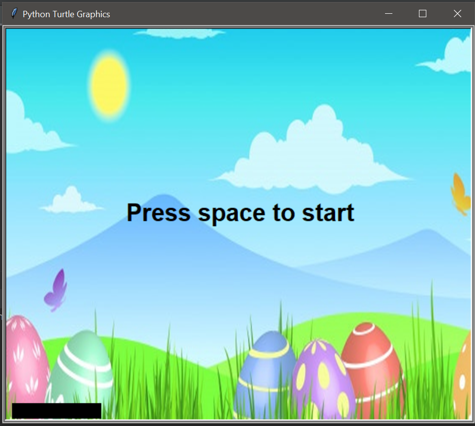

# Egg-Catcher
This is a replica of the old game of catching eggs/balls in a basket.
It is made using Pygame module of Python.

<h3>Starting Screen</h3>

<h3>Game Preview:</h3>

<h3> How to run this </h3>
<li> Dpwnload/Pull the code and the "sunshine 360" picture from the repository.
 <li> Ensure that you have the necessary python modules installed.
<li> Run the 
